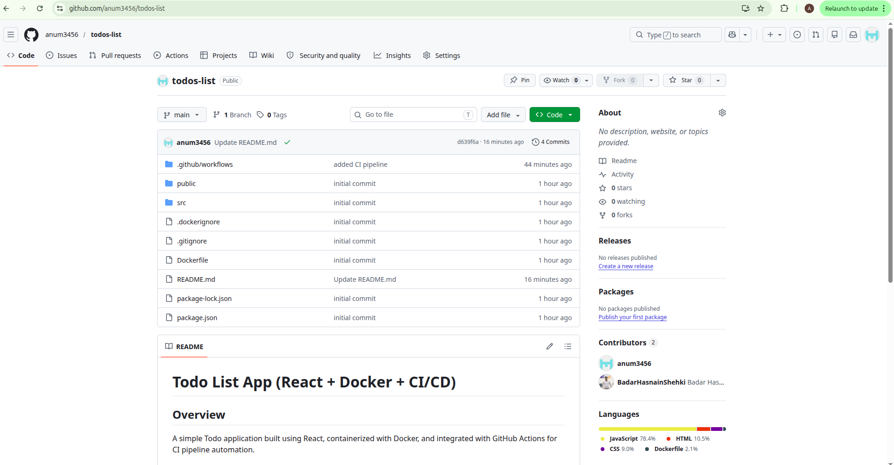
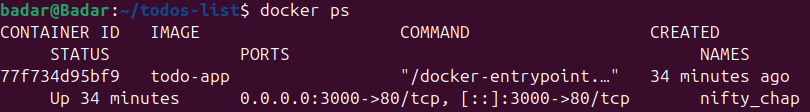
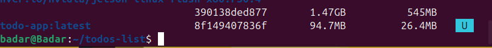
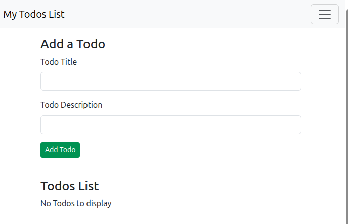
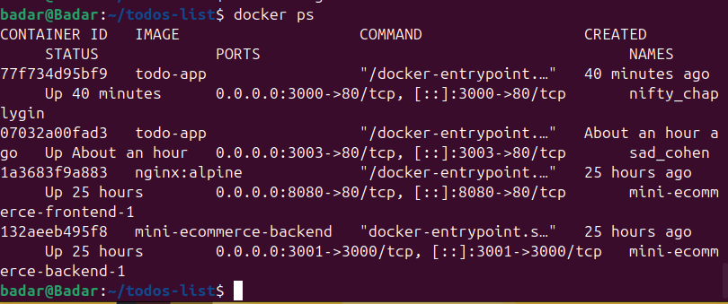

# Todo List App (React + Docker + CI/CD)

## Overview
A simple Todo application built using React, containerized with Docker, and integrated with GitHub Actions for CI pipeline automation.

## Features
- Add / delete / manage todos
- React functional components
- Dockerized production build using Nginx
- CI pipeline using GitHub Actions

## Docker Setup
docker build -t todo-app .
docker run -p 80:80 todo-app

##Run the app
```bash
npm start
```
## Tech Stack
- React.js
- Docker
- Nginx
- GitHub Actions

## Project Screenshots

### GitHub Repository


### Docker Containers Running


### Docker Images


### Application UI


### DevOps Overview

